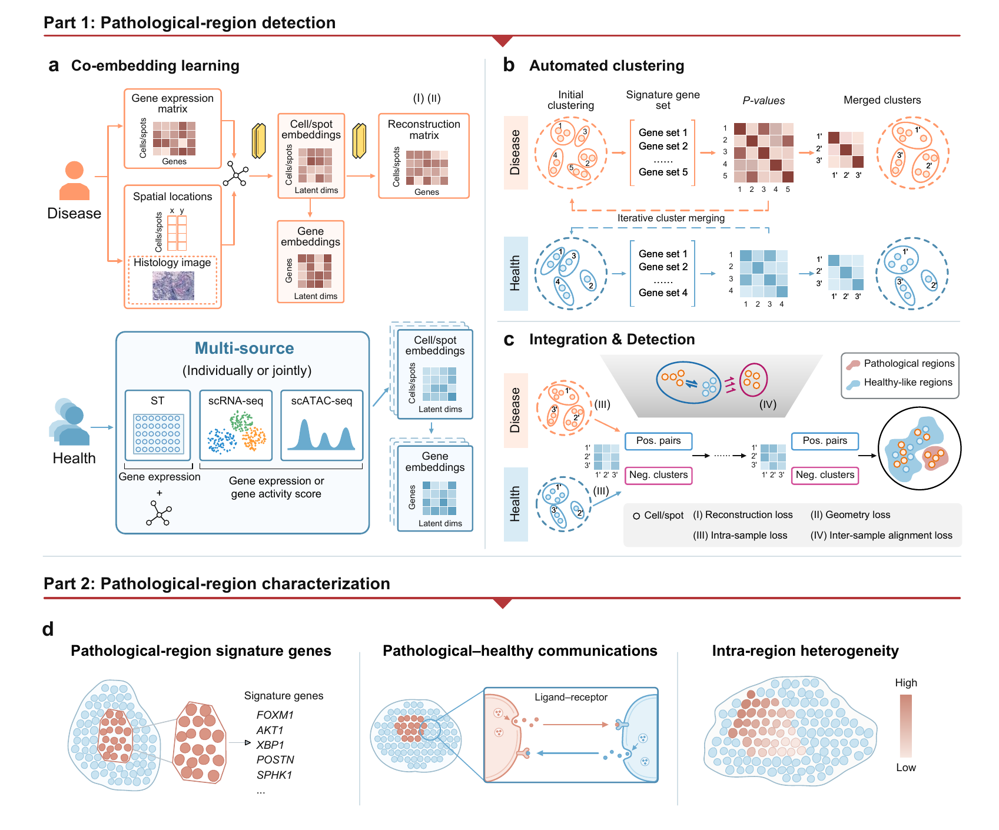

# SpaPath

SpaPath identifies and characterizes pathological regions in spatial transcriptomics using healthy references from ST, scRNA-seq, scATAC-seq, or their combination.

<p align="center">
  
</p>

## Installation

The example workflows use Linux, Python 3.10, and PyTorch with CUDA 12.1. An NVIDIA GPU with a compatible driver is recommended.

```bash
git clone https://github.com/edawu11/SpaPath.git
cd SpaPath
conda create -n spapath python=3.10 pip -y
conda activate spapath
python -m pip install -r requirements.txt
```

The notebooks import SpaPath directly from `scripts/`; no separate package installation is needed.

## Tutorials and data

See the [documentation](https://spapath.readthedocs.io/en/latest/) and [tutorials](https://spapath.readthedocs.io/en/latest/tutorials.html) for breast cancer (BC), non-small-cell lung cancer (NSCLC), oral squamous cell carcinoma (OSCC), multiple myeloma (MM), and Crohn's disease (CD).

Place example inputs in `data/<dataset>/` and open the corresponding notebook in `notebook/` with Jupyter. Results are saved under `outputs/<dataset>/`. **Example data are not included; public download links are pending.**

## Support and license

Questions and bug reports: [GitHub Issues](https://github.com/edawu11/SpaPath/issues). SpaPath is released under the [MIT License](LICENSE).
